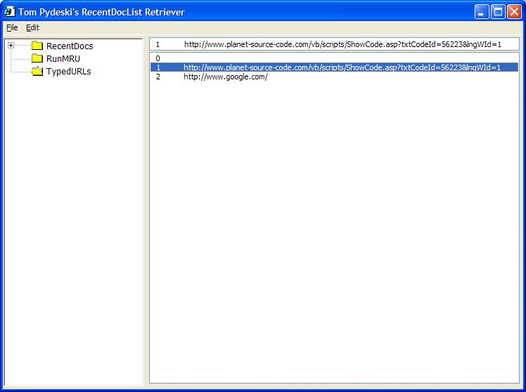



## RecentDocList Retriever

### Description

Updated 12/28/2004

Added the ability to delete all values in a selected node.

Also added the typedURLs key and runMRU key

'This Program will read the Recent Doc List located in the registry at:

'HKEY_CURRENT_USER\Software\Microsoft\Windows\CurrentVersion\Explorer\RecentDocs

'This data is stored in a binary format, so we have to read the binary data into

'a byte array and build it into strings.

'As with all of my submissions, I have utilized code found on PSC and elsewhere

'for various functions, but the rest was written by me.

'Special thanks to Kegham, whose Winstartup 2004 project had some valuable code

'for enumerating and walking through registry keys and for some treeview pointers

'and to MrBoBo who also had some very useful code for the registry

'also to David Sykes for his XP style module that i have implemented in all

'of my projects for that XP Look

'once the key values are loaded into the list, pressing delete will delete the selected

'entry from the registry.

'
 
### More Info
 
Select the Desired subkey within the RecentDocs Key (Binary Info)

'Disclaimer:

'THIS PROGRAM ACCESSES AND MODIFIES ENTRIES IN THE REGISTRY!

'I tested it only on my machine, which is windows XP service pack 2

'I am not responsible for any bad things that may happen due to the

'use of this program

''As with all software using the registry

'BACKUP your registry before using

'This ran fine on my machine and the only thing it deletes are the

'binary entries for the recent doc list

The converted string value

It is the registry....so please be careful!

             |
---                |---
**Submitted On**   |2004-12-28 14:57:58
**By**             |[Tom Pydeski](https://github.com/Planet-Source-Code/PSCIndex/blob/master/ByAuthor/tom-pydeski.md)
**Level**          |Intermediate
**User Rating**    |5.0 (15 globes from 3 users)
**Compatibility**  |VB 6\.0
**Category**       |[Registry](https://github.com/Planet-Source-Code/PSCIndex/blob/master/ByCategory/registry__1-36.md)
**World**          |[Visual Basic](https://github.com/Planet-Source-Code/PSCIndex/blob/master/ByWorld/visual-basic.md)
**Archive File**   |[RecentDocL18341012282004\.zip](https://github.com/Planet-Source-Code/tom-pydeski-recentdoclist-retriever__1-56223/archive/master.zip)

### API Declarations

see code

